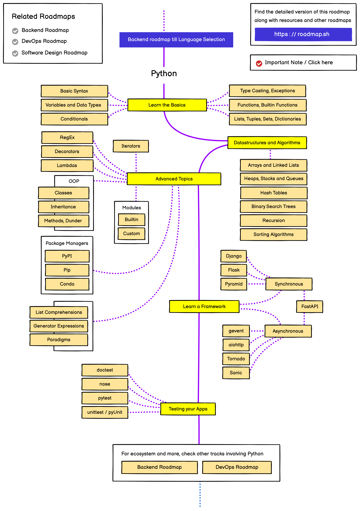

# 😎 Guia do Python 

Bem-vindo ao Guia do Python! Este repositório é o ponto de partida perfeito para quem quer mergulhar no universo do desenvolvimento python. Aqui, você encontrará uma série de arquivos recheados de conceitos, exemplos práticos e links úteis para o desenvolvimento.

## 🗺️ Roadmap

Gosto muito do site [roadmap.sh](https://roadmap.sh/), pois nele é possível encontrar trilhas e recursos valiosos para o aprendizado de diferentes áreas da TI.  Como pode ser visualizado na figura a seguir a trilha de backend e java abrange vários conceitos. 

Não se sinta pressionado a seguir cada passo desta trilha rigidamente. O desenvolvimento backend é uma jornada pessoal, e você pode adaptar seu percurso de acordo com seus interesses, necessidades e objetivos. Use este roadmap como uma bússola, mas sinta-se à vontade para explorar caminhos que despertem mais sua curiosidade.

### Roadmap Backend

## 📚 Conteúdo:

### Python

#### Sintaxe Básica

- [Variáveis e Tipos de Dados](./Python/Sintaxe%20Básica/Variáveis%20e%20Tipos%20de%20Dados.md)
- [Operadores](./Python/Sintaxe%20Básica/Operadores.md)
- [Estruturas de Controle](./Python/Sintaxe%20Básica/Estruturas%20de%20Controle.md)
- [Funções](./Python/Sintaxe%20Básica/Funções.md)
- [Importação de Módulos](./Python/Sintaxe%20Básica/Importando%20Módulos.md)
- [Tratamento de Erros e Exceções](./Python/Sintaxe%20Básica/Tratamento%20de%20Erros%20e%20Exceções.md)
- [Leitura e Escrita de Arquivos](./Python/Sintaxe%20Básica/Leitura%20e%20Escrita%20de%20Arquivos.md)

#### Estruturas de Dados

- [Listas](./Python/Estruturas%20de%20Dados/Listas.md)
- [Tuplas](./Python/Estruturas%20de%20Dados/Tuplas.md)
- [Dicionários](./Python/Estruturas%20de%20Dados/Dicionários.md)
- [Sets](./Python/Estruturas%20de%20Dados/Sets.md)
- [Pilhas e Filas](./Python/Estruturas%20de%20Dados/Pilhas%20e%20Filas.md)
- [Collections](./Python/Estruturas%20de%20Dados/Collections.md)

#### Orientação a Objetos

- [Classes e Objetos](./Python/Orientação%20a%20Objetos/Classes%20e%20Objetos.md)
- [Herança](./Python/Orientação%20a%20Objetos/Herança.md)

#### Programação Funcional

#### Testes 

## 🤝 Contribua!

Este guia está em constante crescimento, e sua contribuição é mais do que bem-vinda! Se você tem dicas, exemplos adicionais ou quer corrigir algo, sinta-se à vontade para abrir uma issue ou enviar um pull request. Vamos tornar este guia ainda mais incrível!

Divirta-se codificando! 🚀✨